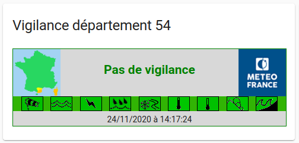
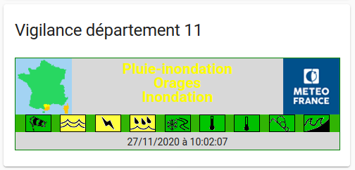

# vigilance card

Cette carte affiche la vigilance Météo-France en s'appuyant sur l'entité **sensor.<DEPARTEMENT>_weather_alert** de l'intégration **meteo-france**



## Installation

### Copie des fichiers

Copie du fichier `meteofrance-vigilance.js` et répertoire `img` du dépot dans `<config directory>/www/meteofrance/` de l'instance Home Assistant.

**Example:**

```bash
wget -O /tmp/master.zip https://github.com/vdomos/homeassistant-vigilance-card/archive/master.zip 
cd <config directory>/www
mkdir -p meteofrance/img/vigilance/
cd meteofrance/
unzip -j /tmp/master.zip homeassistant-vigilance-card-master/meteofrance-vigilance.js
cd img/vigilance/
unzip -j /tmp/master.zip homeassistant-vigilance-card-master/img/vigilance/*
```

### Configuration de la ressource

Faire le lien de la ressource *js* dans votre configuration `configuration.yaml`.

```yaml
lovelace:
  mode: yaml
  resources:
    - url: /local/meteofrance/meteofrance-vigilance.js
      type: module
```

### Ajout de la "custom-card"

Ajouter la nouvealle "card" dans la GUI home-assistant en ajoutant une *custom-card* sur une vue en renseigant avec le type **custom:meteofrance-vigilance** et 
l'entité **sensor.<DEPARTEMENT>_weather_alert** *meteo-france*


**Example:**

```yaml
type: 'custom:meteofrance-vigilance'
entity: sensor.nancy_next_rain
```



